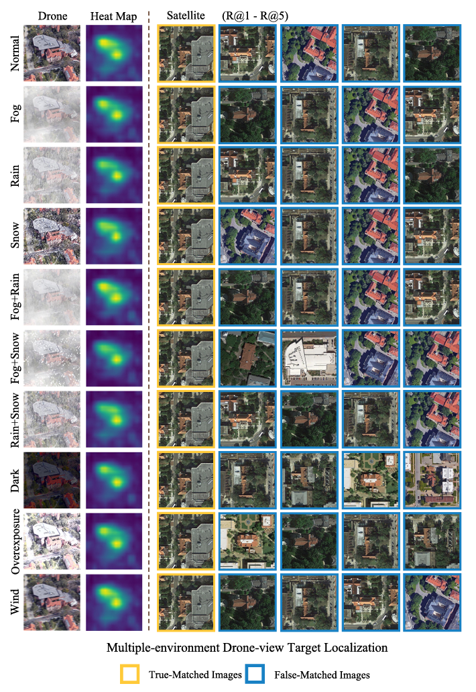

# [Pattern Recognition] Multiple-environment Self-adaptive Network for Aerial-view Geo-localization  

[](https://opensource.org/licenses/MIT) 

<div align="center">
	
</div>
<div align="center">
	
</div>


## MuseNet
[[Paper]](https://arxiv.org/abs/2204.08381) 

## Prerequisites
- Python 3.6
- GPU Memory >= 8G
- Numpy > 1.12.1
- Pytorch 0.3+
- scipy == 1.2.1

## Getting started
### Dataset & Preparation
Download [University-1652](https://github.com/layumi/University1652-Baseline) upon request. You may use the request [template](https://github.com/layumi/University1652-Baseline/blob/master/Request.md).

<!--Download [SUES-200](https://github.com/Reza-Zhu/SUES-200-Benchmark).-->

Download [CVUSA](https://hdueducn-my.sharepoint.com/:u:/g/personal/wongtyu_hdu_edu_cn/EcaV9nPk2NxEgAp4MlV1FH4BplbDSqFMxEqqpwf9ooHshw?e=tIXFsB).

## Train & Evaluation
### Train & Evaluation University-1652
```  
sh run.sh
```
:sparkles:[Download The Trained Model](https://hdueducn-my.sharepoint.com/:u:/g/personal/wongtyu_hdu_edu_cn/EcUM81Bpc35DsgxbbscP9ewB_Qdrtk2TDLc1Z1dLRh0jAg?e=H32yw3)
### Train & Evaluation CVUSA
```  
python prepare_cvusa.py  
sh run_cvusa.sh
```
## Citation

```bibtex
@ARTICLE{wang2024Muse,
  title={Multiple-environment Self-adaptive Network for Aerial-view Geo-localization}, 
  author={Wang, Tingyu and Zheng, Zhedong and Sun, Yaoqi and Yan, Chenggang and Yang, Yi and Tat-Seng Chua},
  journal = {Pattern Recognition},
  volume = {152},
  pages = {110363},
  year = {2024},
  doi = {https://doi.org/10.1016/j.patcog.2024.110363}}
```

```bibtex
@ARTICLE{wang2021LPN,
  title={Each Part Matters: Local Patterns Facilitate Cross-View Geo-Localization}, 
  author={Wang, Tingyu and Zheng, Zhedong and Yan, Chenggang and Zhang, Jiyong and Sun, Yaoqi and Zheng, Bolun and Yang, Yi},
  journal={IEEE Transactions on Circuits and Systems for Video Technology}, 
  year={2022},
  volume={32},
  number={2},
  pages={867-879},
  doi={10.1109/TCSVT.2021.3061265}}
```
```bibtex
@article{zheng2020university,
  title={University-1652: A Multi-view Multi-source Benchmark for Drone-based Geo-localization},
  author={Zheng, Zhedong and Wei, Yunchao and Yang, Yi},
  journal={ACM Multimedia},
  year={2020}
}
```
## Related Work

